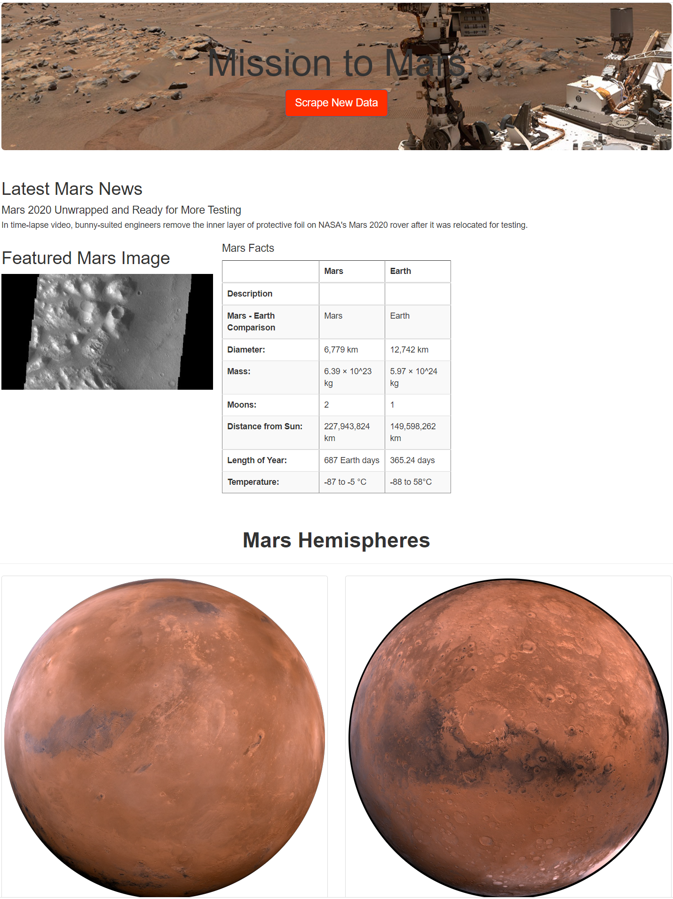
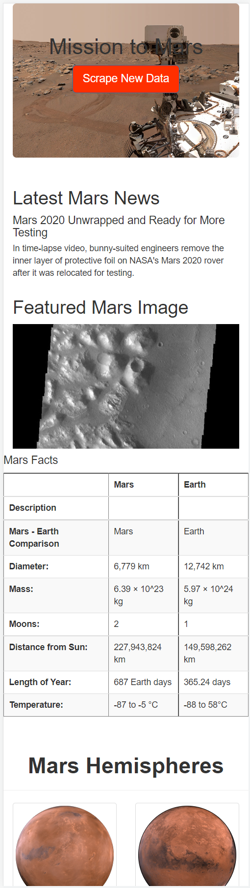

# Mission-to-Mars

The purpose of this project was to complete 4 tasks:

* Scrape Data off of a Web Page
* Add the data to a MongoDB Database
* Use Flask to build a Web Page using the MongoDB data
* Stylize the Web Page using Bootstrap
 
## Files
 
The completed assignment required the completion of 4 files.

 
The first step was to build the structure where by we would scrape the data using the following python file:

 

[Mission_to_Mars_Challenge.py](Mission_to_Mars_Challenge.py)

 
The next step was to create the code to scrape the data and save it to the Database, which was completed with the following python file:

 

[scraping.py](scraping.py)

 
The next step was to set up Flask to build our HTML page and pull the data from MongoDB using PyMongo using the following python file:

 

[app.py](app.py)

 
Lastly there is the index.html file created by Flask:

 

[index.html](./templates/index.html)

 

## What does the web page look like?

  
This is a screenshot of the page as it would be seen on a browser on a computer:
  
  

 
This is a screenshot of the page as it would be seen on a browser on a phone:
 
  
